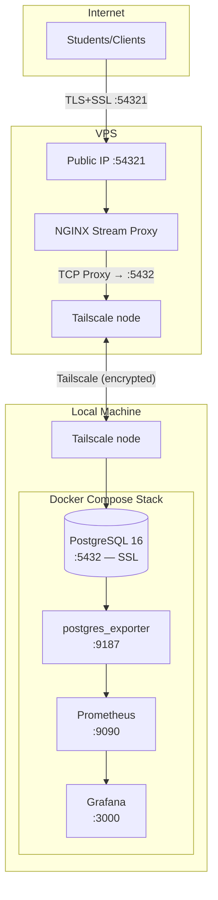
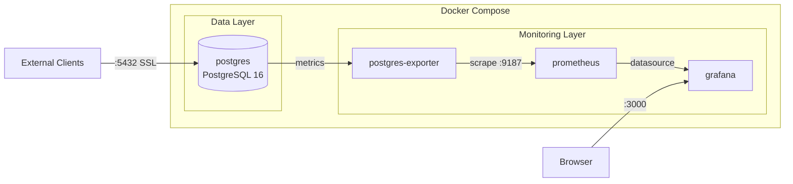
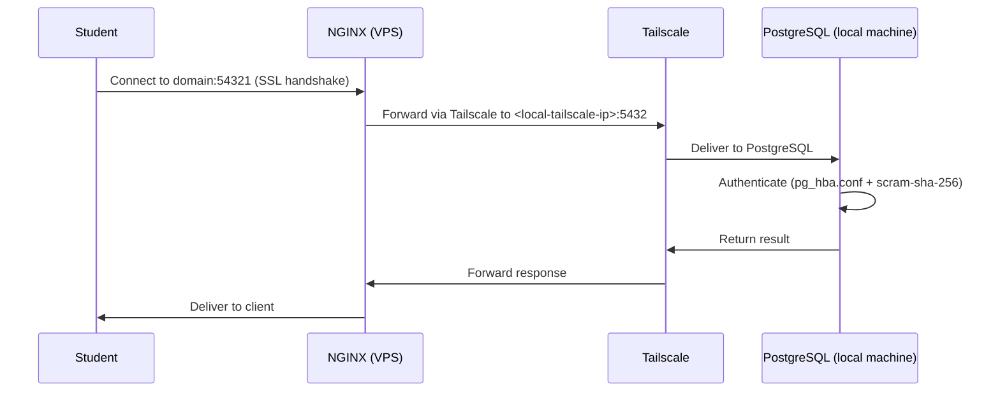
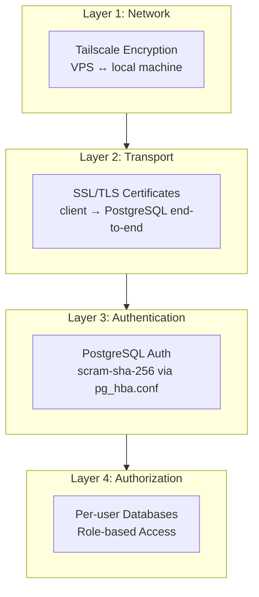
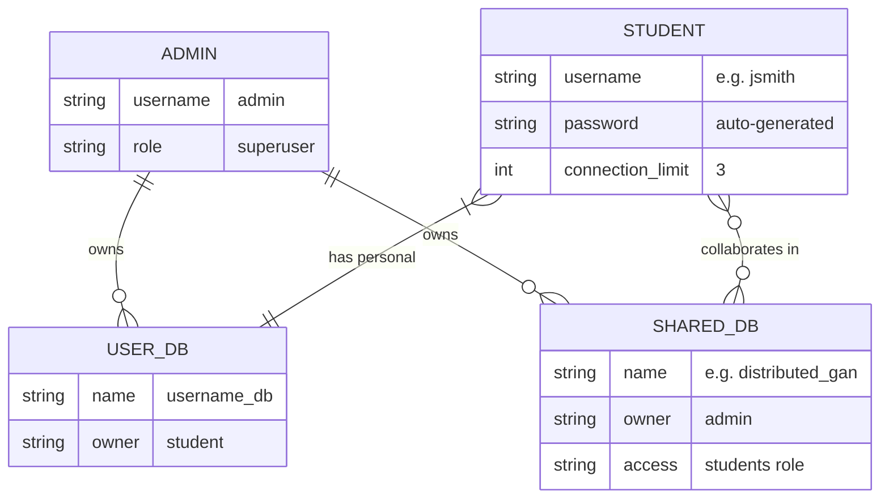
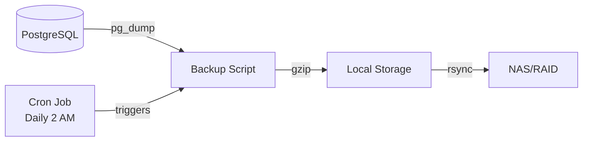
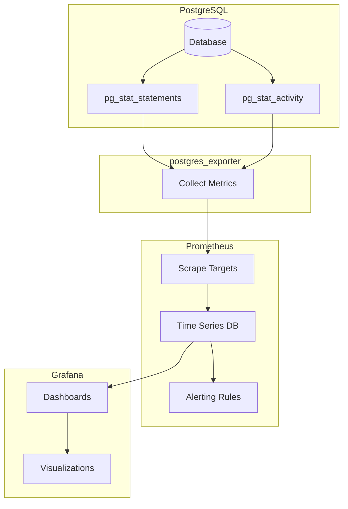

# Architecture

Detailed architecture diagrams for the self-hosted PostgreSQL setup.

## Network topology

The local machine and VPS are both nodes on a Tailscale tailnet. The VPS acts as the public entry point: NGINX receives incoming TCP connections on port 54321 and proxies them over Tailscale to PostgreSQL running on the local machine. There is no direct exposure of the database host to the internet.



## Docker services



## Data flow



## Security layers



## Database structure



## Backup flow



## Monitoring stack



## Viewing these diagrams

These Mermaid diagrams render automatically on:
- GitHub (README, markdown files)
- GitLab
- Notion
- VS Code (with Mermaid extension)

Or paste into [mermaid.live](https://mermaid.live) to view/edit.
        string password "auto-generated"
        int connection_limit "3"
    }
    
    USER_DB {
        string name "username_db"
        string owner "student"
    }
    
    SHARED_DB {
        string name "e.g. distributed_gan"
        string owner "admin"
        string access "students role"
    }
```

## Backup flow


## Monitoring stack


## Viewing these diagrams

These Mermaid diagrams render automatically on:
- GitHub (README, markdown files)
- GitLab
- Notion
- VS Code (with Mermaid extension)

Or paste into [mermaid.live](https://mermaid.live) to view/edit.
